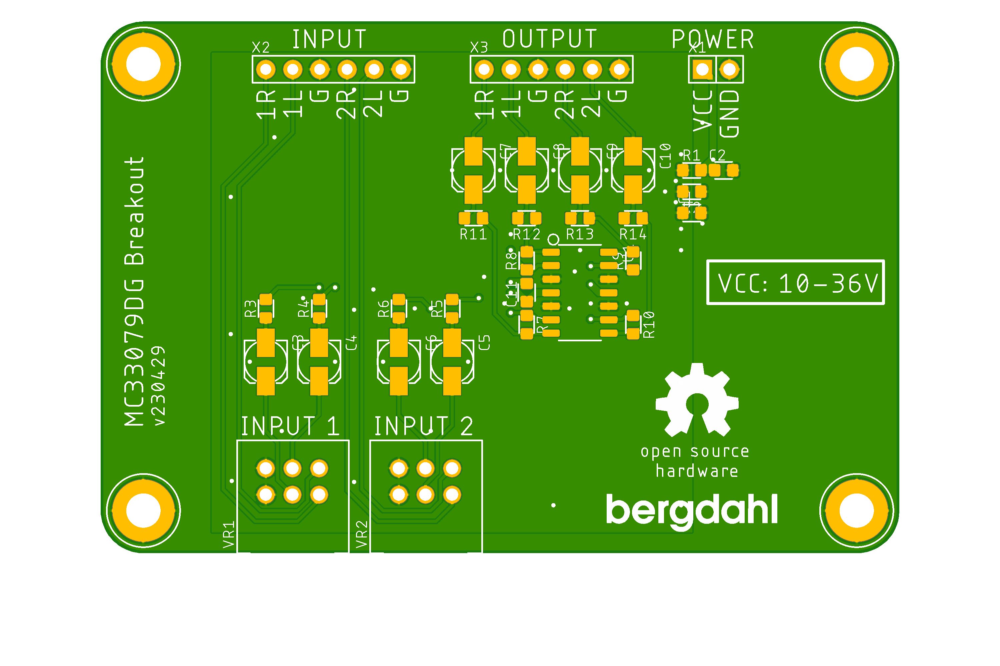

# Audio_MC33079DG_Breakout

This is a breakout board for the ON Semiconductor MC33079DG chip, setup for an audio configuration.

According to the manufacturer:

The MC33078/9 series is a family of high quality monolithic
amplifiers employing Bipolar technology with innovative high
performance concepts for quality audio and data signal processing
applications

## Inputs
Name | Description
---- | ----
1R | Input 1 Right CHannel
1L | Input 2 Left Channel
G | Analog Ground
2R | Input 2 Right Channel
2L | Input 2 Left Channel
G | Analog Ground

## Outputs
Name | Description
---- | ----
1R | Output 1 Right CHannel
2L | Output 1 Left Channel
G  | Analog Ground
2R | Output 2 Right Channel
2L | Output 2 Left Channel
G | Analog Ground

## Power
Name | Description
---- | ----
VCC | 10-36V power
GND | Ground
